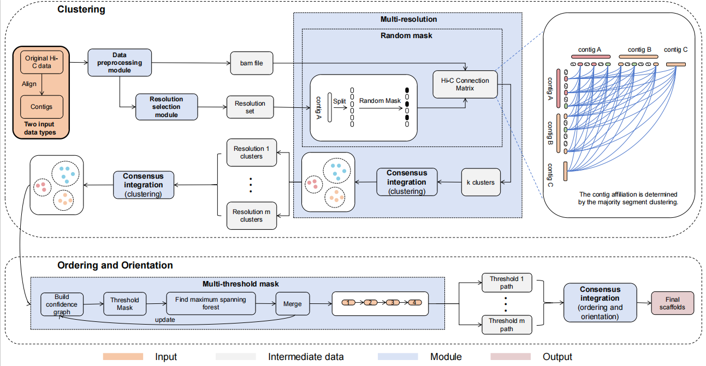

# Catalogue
- [ConHiC](#conhic)
- [Env](#env)
- [Data preprocess](#data-preprocess)
- [ConHiC scaffolding pipeline](#conhic-scaffolding-pipeline)
- [Evaluation](#evaluation)
- [Visualize the results](#visualize-the-results)

---

# ConHiC
A Polyploid Genome Hi-C Chromosome-Level Scaffolding Method Based on Multi-Scale Masking Mechanism and Consensus.

<br>

<div align="center">
    <strong>ConHiC Pipline</strong>
</div>
<div align="center">
    <!-- 请在此处插入您的第一张图片 -->
    <!-- 建议图片路径示例：./figures/conhic_core_flowchart.png -->
    <!-- 或使用完整路径：/path/to/your/figure1.png -->
    
    <br>
    
</div>

<br>


---

# Env
```bash
$ bash ConHiC/env/environment_conhic.sh
```

# Data preprocess
For this part, we need to obtain the usable asm.fa and HiC.filtered.bam.
```bash
# step 1: get asm.fa
## For simulating data of different N50 values
python /ConHiC/preprocess/sim_contigs.py ref.fa N50 > asm.fa
## For the real data, first divide the reference gene sequence by N, and then randomize the direction and position.
python /ConHiC/preprocess/split_fasta.py ref.fa > split_ref.fa
python /ConHiC/preprocess/shuffle_fasta.py split_ref.fa > asm.fa

# Step 2: Indexing, Deduplication and Alignment, resulting in the bam file
$ bwa index asm.fa
$ bwa mem -5SP -t 28 asm.fa r1_fq.gz r2_fq.gz | samblaster | samtools view - -@ 14 -S -h -b -F 3340 -o HiC.bam

# Step 3: Obtain the filtered BAM file
$ /ConHiC/utils/filter_bam HiC.bam 1 --nm 3 --threads 14 | samtools view - -b -@ 14 -o HiC.filtered.bam
```

# ConHiC scaffolding pipeline
```bash

# ConHiC (cluster)
/ConHiC/run/ConHiC pipeline asm.fa HiC.filtered.bam nchrs --RE restriction_enzymes 

# ConHiC (cluster+sort)
/ConHiC/run/ConHiC sort asm.fa HT_links.pkl split_clms final_groups/group*.txt 
python comprehensive_sort.py
/ConHiC/run/ConHiC build asm.fa asm.fa HiC.filtered.bam final_tours/group*.tour
```

# Evaluation 
```bash
# Evaluate the clustering effect
python /ConHiC/evaluation/eval_clustering.py  asm.fa  final_groups

# Evaluate the scaffolding effect
## (1) First, we need to simulate the ground true clustering groups to facilitate the evaluation.
python /ConHiC/evaluation/get_gt_groups.py  asm.fa

## (2) Transfer the GT_groups folder from (1) to evaluate the scaffolding effect.
python /ConHiC/evaluation/eval_scaffolding.py GT_groups scaffolds.agp
```

# Visualize the results
```bash
cd visual
# draw clustering result table
python draw_cluster.py
# draw clustering result bar chart
python draw_cluster_bar.py
# draw scaffolding result table
python draw_cluster.py
# draw scaffolding result bar chart
python draw_cluster_bar.py
# Ablation experiment
## Multi-resolution
python Ablation_Multi-resolution.py
## Multi-threshold-mask
python Ablation_Multi-threshold.py
## Random mask
python Ablation_random_mask.py
python Ablation_random_mask_count_group_files.py
# data statistic
python draw_data_statistic.py
## (1) do kmer analysis
python kmer_annotator.py reference.fasta assembly.fasta
## (2) draw the graph
python kmer.py
# draw Alignment analysis
# for each data
## (1) get the umi file for each hap
unimap -d chr*_*.umi ref.chr*_*.fa -t 40
## (2) get the paf file for each hap
unimap -c chr*_*.umi scaffolds.fa -x asm5 --cs -N 50 --secondary=no -t 40 > scaffolds_chr*_*.paf
## (3) concatenate all PAF files together
cat scaffolds_chr*_1.paf scaffolds_chr*_2.paf scaffolds_chr*_3.paf scaffolds_chr*_4.paf > scaffolds_chr*.paf
## (4) Obtain the paf file corresponding to each haplotype group, should get group*| in the Kmer anlalysis
grep "chr*_" scaffolds_chr*.paf | egrep "group*|" | cut -f 1-12,21 | sed 's/de:f://g' | awk '{print $1"\t"$2"\t"$3"\t"$4"\t"$5"\t"$6"\t"$7"\t"$8"\t"$9"\t"(1-$13)*$11"\t"$11"\t"$12}' > conhic_chr*.paf
## (5) Draw a comparison chart (summarizing all chromosome haplotypes)
/ConHiC/visual/paf2dotplot/paf2dotplot.r -o all_chromosomes -p 20 conhic_chr*.paf
```